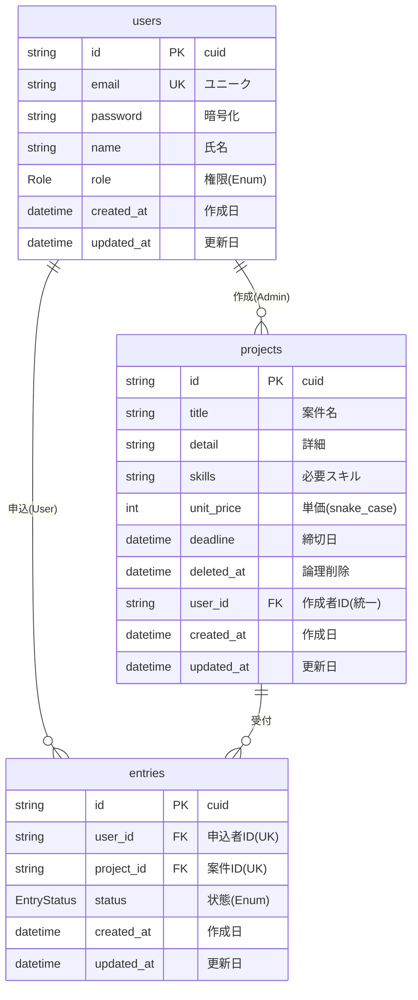

```mermaid
erDiagram
users ||--o{ projects : "作成(Admin)"
users ||--o{ entries : "申込(User)"
projects ||--o{ entries : "受付"

users {
    string id PK "cuid"
    string email UK "ユニーク"
    string password "暗号化"
    string name "氏名"
    Role role "権限(Enum)"
    datetime created_at "作成日"
    datetime updated_at "更新日"
}

projects {
    string id PK "cuid"
    string title "案件名"
    string detail "詳細"
    string skills "必要スキル"
    int unit_price "単価(snake_case)"
    datetime deadline "締切日"
    datetime deleted_at "論理削除"
    string user_id FK "作成者ID(統一)"
    datetime created_at "作成日"
    datetime updated_at "更新日"
}

entries {
    string id PK "cuid"
    string user_id FK "申込者ID(UK)"
    string project_id FK "案件ID(UK)"
    EntryStatus status "状態(Enum)"
    datetime created_at "作成日"
    datetime updated_at "更新日"
}

```